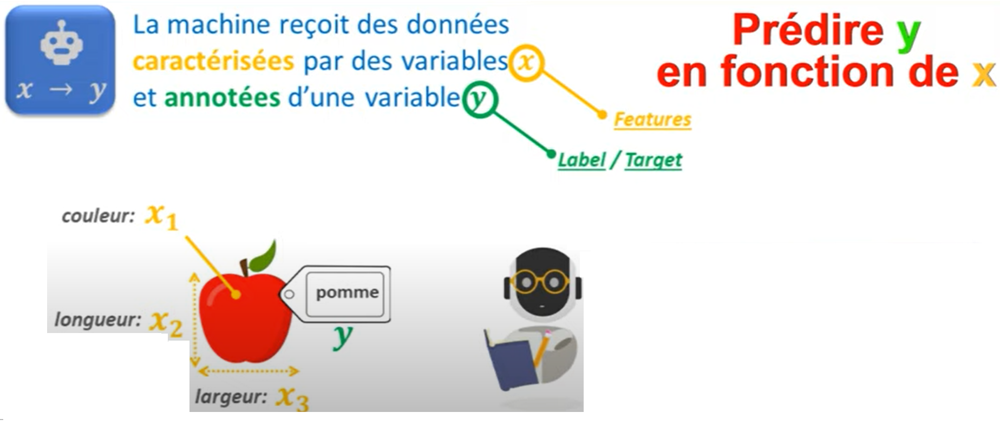
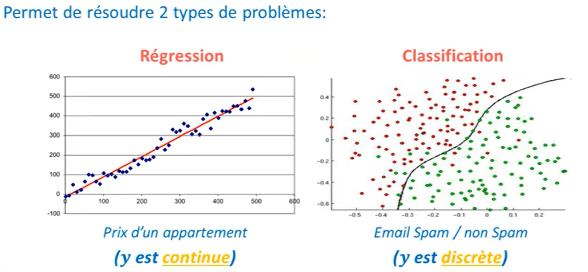
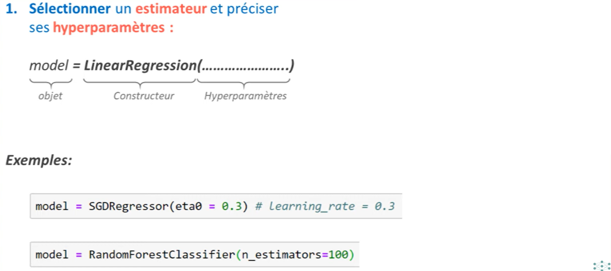
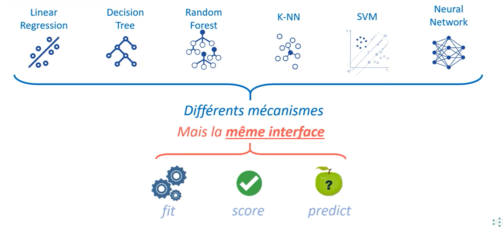
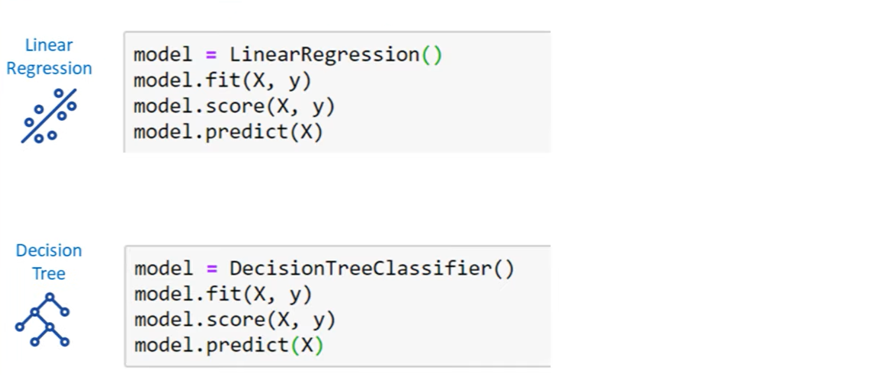
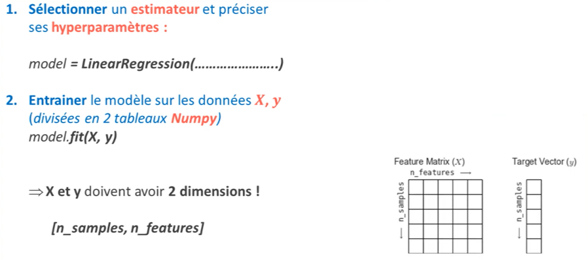

# Machine Learning
Le Machine Learning peut être défini comme étant une technologie d’intelligence artificielle permettant aux machines d’apprendre sans avoir été au préalablement programmées spécifiquement à cet effet. Le Machine Learning est explicitement lié au Big Data, étant donné que pour apprendre et se développer, les ordinateurs ont besoin de flux de données à analyser, sur lesquelles s’entraîner.

## Définition
Le Machine Learning consiste à développer un modèle mathematique à partir des données expérimentales.

## Techniques de Machine Learning

## Apprentissage Supervisé

## Choix de modèle

## Optimisation de l'algorithme

## Prédiction

## Regression et classification

## Création de modèle en SKLEARN en Python

Pour créer un modèle, on crée un objet de la classe correspondante:

## Interface des modèle
Même si les paramètres et les mecanismes de ces modèles sont differents, mais ils ont les mêmes interfaces d'interaction.

## Exemple 
Par exemple ci-dessous vous retrouvez l'utilisation d'un modèle de régression lineaire et d'arbre de décision.

## La régression Lineaire

